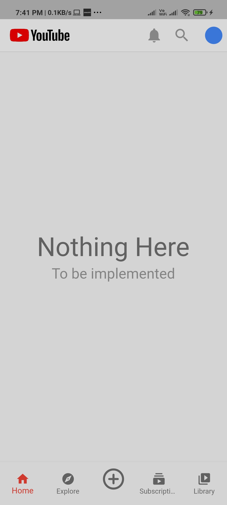
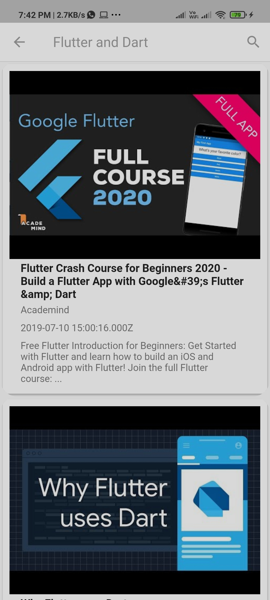
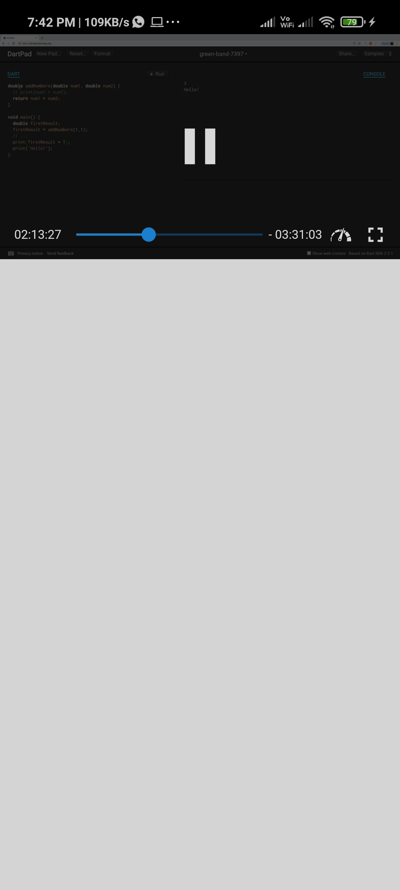
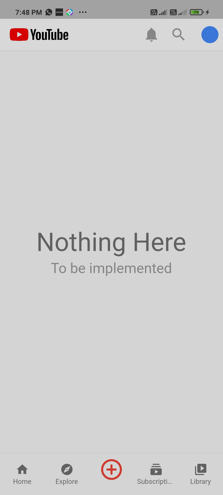

# YouTube Clone

A Challenge app for Internship.

### Show some :heart: and star the repo to support the project

## Getting Started 🚀

- Clone the repo `git clone https://github.com/hiteshgarg123/CORONA-TRACKER`
- Install the dependicies `flutter pub get`
- Run it `flutter run`

## Dependencies 🧐

- [http](https://pub.dev/packages/http) to make requests.
- [youtube_player_flutter](https://pub.dev/packages/youtube_player_flutter) to play YouTube videos.
- [connectivity](https://pub.dev/packages/connectivity) to monitor for connectivity changes.

## Features 💡

- Good looking UI with bottom Navigation Bar.
- Complete search functionality.
- Auto search and update results after 3 characters.
- Internet connectivity detector to reduce API calls and make UX better.
- Some more checks to avoid unnecessary builds.

## Preview 📸

|                                                 |                                                 |                                                 |
| ----------------------------------------------- | ----------------------------------------------- | ----------------------------------------------- |
|  |  |  |

|                                                 |                                                 |                                                 |
| ----------------------------------------------- | ----------------------------------------------- | ----------------------------------------------- |
|  |  |  |

## Contact me 📧

#### Email : hiteshgarg285@gmail.com

A few resources to get you started if this is your first Flutter project:

- [Lab: Write your first Flutter app](https://flutter.dev/docs/get-started/codelab)
- [Cookbook: Useful Flutter samples](https://flutter.dev/docs/cookbook)

For help getting started with Flutter, view our
[online documentation](https://flutter.dev/docs), which offers tutorials,
samples, guidance on mobile development, and a full API reference.
